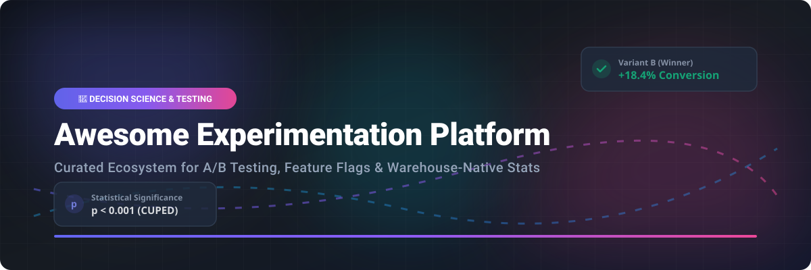

# 🧪 Awesome Experimentation Platform

<p align="center">
  <a href="https://github.com/ishandutta2007/Awesome-Awesome-Awesome"></a>
  <a href="https://discord.gg/jc4xtF58Ve"></a>
  <a href="https://github.com/ishandutta2007/Awesome-Experimentation-Platform/stargazers"></a>
  <a href="https://github.com/ishandutta2007/Awesome-Experimentation-Platform/network/members"></a>
  <a href="https://github.com/ishandutta2007/Awesome-Experimentation-Platform/pulls"></a>
  <a href="https://github.com/ishandutta2007"></a>
</p>

<p align="center">
  
</p>

## 📌 Top Experimentation Platforms & Decision Science Ecosystem

**Curated List of SaaS Products & Open-Source GitHub Projects**

*Focused on A/B Testing, Multivariate Testing, Feature Flags, Warehouse-Native Experimentation & Product Analytics*

> **Last updated: September 2026**

---

### 💡 Overview

This repository tracks notable **SaaS platforms** and **open-source projects** for **Experimentation** (A/B testing, multivariate testing, feature experimentation, CUPED variance reduction, and product decision science). These tools empower engineering, data science, and product teams to design, evaluate, analyze, and automate experiments—often tightly integrated with feature flag rollouts and modern data warehouses (Snowflake, BigQuery, Databricks).

---

## 📑 Table of Contents

- [📊 Sector Insights & Market Size](#-sector-insights--market-size)
- [🏢 Commercial SaaS Platforms](#-commercial-saas-platforms)
- [🔓 Open-Source GitHub Projects](#-open-source-github-projects)
- [🛠️ Architecture & Best Practices](#%EF%B8%8F-architecture--best-practices)
- [🤝 How to Contribute](#-how-to-contribute)
- [💖 Support & Community](#-support--community)
- [📈 Star History](#-star-history)
- [⚠️ Disclaimer](#%EF%B8%8F-disclaimer)

---

## 📊 Sector Insights & Market Size

> 📈 **Market Size & Fragmentation:**  
> The global **Experimentation & A/B Testing Software market** is estimated at **$1.85 Billion in 2024** and is projected to expand to **$3.80 Billion by 2030** (CAGR ~12.5%). The market is **moderately fragmented**, balancing enterprise digital experience suites (Adobe Target, Optimizely) alongside fast-growing warehouse-native and developer-centric experimentation startups (LaunchDarkly, Statsig, Eppo, GrowthBook).

---

## 🏢 Commercial SaaS Platforms

Below is a curated list of top SaaS experimentation products, sorted by **Company Size / Valuation / Revenue** in descending order.

| 🚀 Product Name | 📝 Description | 🏢 Company Size / Valuation / Revenue | 💰 Pricing (Starting Tier) | 🎁 Free Tier Limit / Free Trial Limit |
| :--- | :--- | :--- | :--- | :--- |
| **[Adobe Target](https://www.adobe.com/sensei/advanced-intelligence/adobe-target.html)** | Enterprise AI-driven experimentation, personalization, and omnichannel optimization engine. | ~$5.3 Billion *(Adobe Experience Cloud ARR)* | ~$2,000 / month *(billed annually)* | 30-day enterprise sandbox trial with full target access upon request |
| **[Harness / Split](https://www.split.io/)** | Feature delivery and experimentation platform with impact monitoring and automated root-cause detection. | ~$3.7 Billion *(Harness Valuation)* | $33 / user / month *(Developer plan)* | 14-day free trial supporting up to 10 team members |
| **[LaunchDarkly Experimentation](https://launchdarkly.com/)** | Feature management and experimentation platform for controlled rollouts and user targeting. | ~$3.0 Billion *(Valuation)* | $8 / user / month *(Starter plan)* | 14-day trial, plus Free Forever Starter plan for up to 1,000 MAUs |
| **[Optimizely](https://www.optimizely.com/)** | Digital experience and web/server-side A/B testing platform with enterprise analytics. | ~$1.1 Billion *(Valuation / $400M+ ARR)* | ~$3,000 / month *($36,000/year for Web Starter)* | 30-day free trial on Optimizely Web Starter |
| **[Statsig](https://www.statsig.com/)** | Developer-centric feature flags, warehouse-native stats engine, and product experimentation platform. | ~$400 Million *(Valuation)* | $150 / month *(Pro plan)* | Free forever tier up to 1 Million events/month (or 500k MAUs) |
| **[Dynamic Yield](https://www.dynamicyield.com/)** | Personalization and algorithmic experimentation engine for commerce and digital channels. | ~$300 Million *(Acquired by Mastercard)* | ~$3,500 / month *(Enterprise base)* | 14-day guided sandbox demo trial |
| **[Eppo](https://www.geteppo.com/)** | Warehouse-native experimentation platform for data teams with CUPED and metric governance. | ~$200 Million *(Valuation / $47M+ Raised)* | $500 / month *(Starter tier)* | 14-day full feature trial for data & analytics teams |
| **[GrowthBook (Cloud)](https://www.growthbook.io/)** | Managed cloud version of GrowthBook for warehouse-native A/B testing and feature flags. | ~$60 Million *(Valuation / YC Backed)* | $20 / user / month *(Pro tier)* | Free forever plan up to 3 team members & 10,000 MTUs |
| **[AB Tasty](https://www.abtasty.com/)** | Web experiment, CRO, and user experience testing platform. | ~$50 Million *(ARR)* | ~$1,000 / month *($12,000/year)* | 14-day free trial upon demo registration |
| **[VWO (Visual Website Optimizer)](https://vwo.com/)** | Visual A/B testing, multivariate experimentation, and conversion rate optimization suite. | ~$40 Million *(ARR)* | $198 / month *(Growth plan, billed annually)* | Free Starter plan forever up to 50,000 tested visitors/month |
| **[Kameleoon](https://www.kameleoon.com/)** | AI-enhanced experimentation and web personalization tool for digital product teams. | ~$30 Million *(ARR)* | ~$850 / month *($10,200/year)* | 14-day free trial up to 5,000 visitors |

---

## 🔓 Open-Source GitHub Projects

Curated list of leading open-source experimentation frameworks, feature flag managers, and statistics packages, sorted by **GitHub Star Count** (descending).

1. **[PostHog](https://github.com/PostHog/posthog)** [](https://github.com/PostHog/posthog/stargazers)  
   *All-in-one open-source product analytics, session recording, feature flags, and A/B experimentation suite.*

2. **[Unleash](https://github.com/Unleash/unleash)** [](https://github.com/Unleash/unleash/stargazers)  
   *Enterprise-grade open-source feature management platform with canary deployments and rollout experiments.*

3. **[GrowthBook](https://github.com/growthbook/growthbook)** [](https://github.com/growthbook/growthbook/stargazers)  
   *Leading warehouse-native open-source platform for feature flags, A/B testing, CUPED variance reduction, and Bayesian statistics engines.*

4. **[Flagsmith](https://github.com/Flagsmith/flagsmith)** [](https://github.com/Flagsmith/flagsmith/stargazers)  
   *Open-source feature flag and remote configuration engine supporting segment-based multivariate testing.*

5. **[Flipt](https://github.com/flipt-io/flipt)** [](https://github.com/flipt-io/flipt/stargazers)  
   *Blazing-fast self-hosted feature flag and experiment evaluation engine built in Go.*

6. **[FeatBit](https://github.com/FeatBit/FeatBit)** [](https://github.com/FeatBit/FeatBit/stargazers)  
   *Open-source 100% developer-centric feature management and experimentation platform.*

7. **[Sixpack](https://github.com/seatgeek/sixpack)** [](https://github.com/seatgeek/sixpack/stargazers)  
   *Language-agnostic A/B testing framework built by SeatGeek using Redis and Python.*

8. **[PlanOut](https://github.com/facebookarchive/planout)** [](https://github.com/facebookarchive/planout/stargazers)  
   *Facebook's foundational framework for online field experiments and complex randomizations.*

9. **[OpenFeature Spec](https://github.com/open-feature/spec)** [](https://github.com/open-feature/spec/stargazers)  
   *CNCF vendor-neutral open standard for feature flagging and experimentation SDKs.*

10. **[Wasabi](https://github.com/intuit/wasabi)** [](https://github.com/intuit/wasabi/stargazers)  
    *Intuit's 100% open-source high-performance A/B testing platform for web, mobile, and desktop.*

11. **[Spotify Confidence SDK](https://github.com/spotify/confidence)** [](https://github.com/spotify/confidence/stargazers)  
    *Spotify's developer SDKs and experimentation interfaces for enterprise-scale testing.*

---

## 🛠️ Architecture & Best Practices

```
┌───────────────────────────┐      ┌───────────────────────────┐
│   Feature Flag / SDK      │ ───► │ Exposure Logging Engine   │
│  (GrowthBook, Unleash, etc)│      │  (Snowflake, BigQuery)    │
└─────────────┬─────────────┘      └─────────────┬─────────────┘
              │                                  │
              ▼                                  ▼
┌───────────────────────────┐      ┌───────────────────────────┐
│ User Assignment & Variant │      │ Statistical Engine (CUPED)│
└───────────────────────────┘      └───────────────────────────┘
```

1. **Assignment via Feature Flags**: Instrument variant evaluation using OpenFeature SDKs or GrowthBook/Statsig SDKs.
2. **Log Exposures & Events**: Persist raw exposures and user action logs to your data warehouse.
3. **Warehouse-Native Statistics**: Compute variance reduction (CUPED), sample ratio mismatch (SRM) checks, and sequential p-values directly over warehouse metrics.
4. **Decision Rollouts**: Instantly rollout winning variants or kill degrading variants using flag controls.

---

## 🤝 How to Contribute

Contributions are warmly welcomed! To contribute:

1. **Fork** the repository.
2. Add or update entries in `README.md` following the tabular or bullet format.
3. Verify that links are active and descriptions remain factual and objective.
4. Submit a **Pull Request (PR)** with a clear summary of your changes.

Check out our curated awesome ecosystem list at **[Awesome-Awesome-Awesome](https://github.com/ishandutta2007/Awesome-Awesome-Awesome)** for more topics!

---

## 💖 Support & Community

If you find this repository helpful, please consider showing your support:

- 🌟 **Star this repository** to help others discover it!
- 🔀 **Fork** and contribute new tools or updates.
- 📢 **Share** with your teammates, product managers, and data engineers.
- ☕ **Sponsor / Buy me a coffee:** Support ongoing open-source maintenance via [GitHub Sponsors](https://github.com/sponsors/ishandutta2007).

---

## 📈 Star History

[](https://star-history.dera.page/#ishandutta2007/Awesome-Experimentation-Platform&type=date&legend=top-left)

---

## ⚠️ Disclaimer

This is a community-curated list and is not an official endorsement of any vendor or platform. Experimentation affects user experience and business metrics; always perform statistical validation and security reviews before deploying in production environments.
